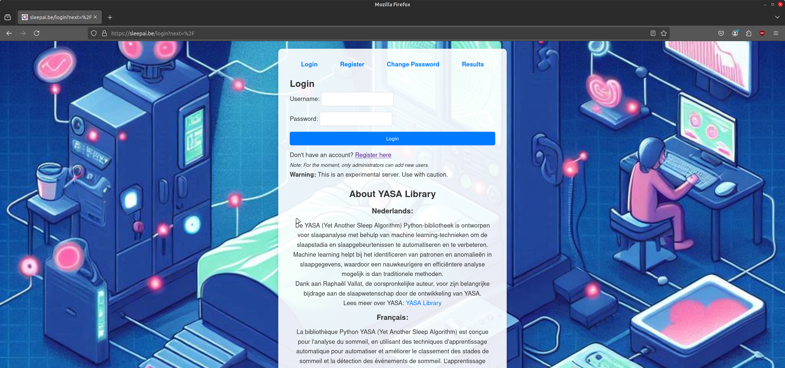
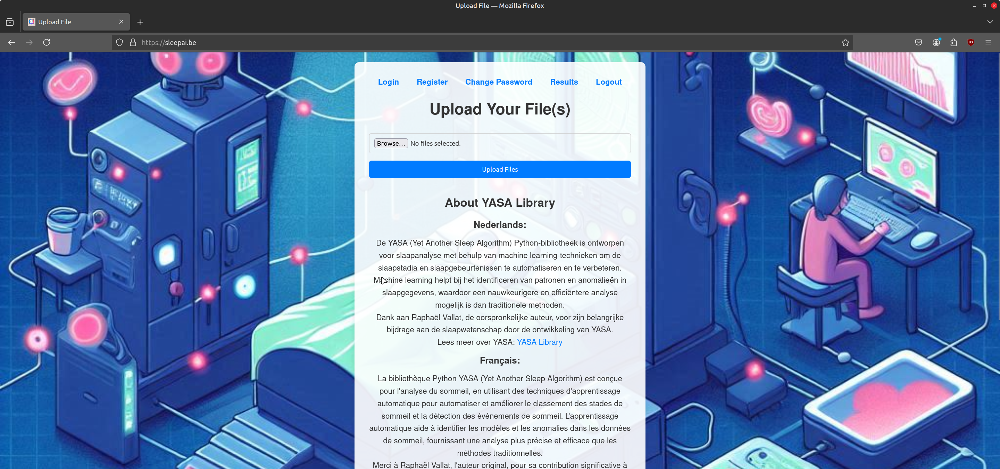
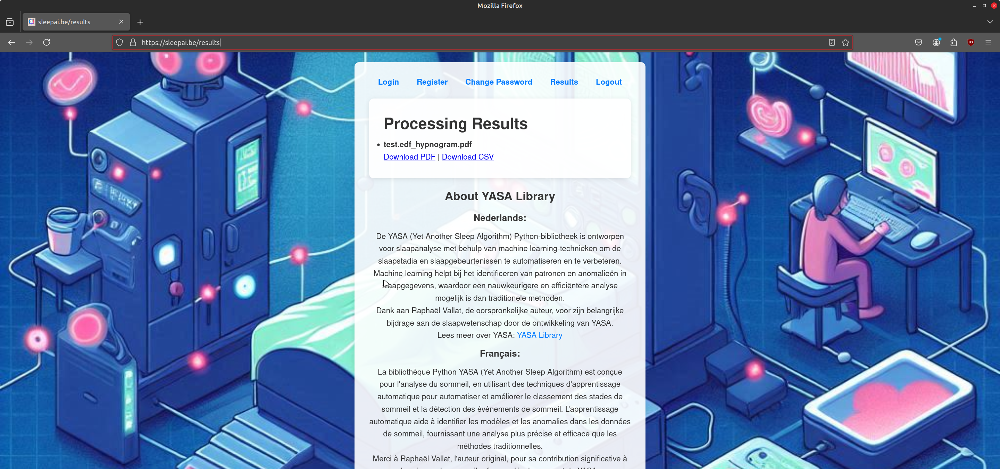

# YASA Flaskified


## Overview
YASA Flaskified is a web application designed to streamline EEG data processing and sleep analysis. Built on Flask, Redis, Gunicorn, and Nginx, it integrates the **YASA** Python library for automated sleep staging and hypnogram generation. This platform allows users to upload EEG files, process them asynchronously, and visualize the results in an easy-to-use interface.

YASA Flaskified is built upon the **YASA** library developed by Raphaël Vallat. YASA is a powerful tool for sleep analysis using machine learning techniques, enabling precise and efficient sleep staging and event detection. Special thanks to the original author for his contributions to the scientific community.

- Learn more about the YASA library on [Raphaël Vallat’s website](https://raphaelvallat.com/yasa/)
- Explore the related article published in **eLife**: [Automated sleep staging with YASA](https://elifesciences.org/articles/70092)

The deployment is simplified with an automated script (`deploy.sh`) to set up the application on a fresh Ubuntu 24.04 server.

You can find the full project on GitHub at: [YASA Flaskified Repository](https://github.com/bartromb/YASAFlaskified)

**Disclaimer**

Use of this software is at your own risk. YASA Flaskified is provided "as is," without warranty of any kind, express or implied. The developers assume no responsibility for any damages or consequences resulting from the use of this application.

---

## Screenshots

### 1. **Login Page**
The secure login page ensures access control for authenticated users:


### 2. **Upload Page**
Easily upload EEG files (e.g., `.edf`) for processing:


### 3. **Results Page**
View and download processed results, including hypnograms and CSV files:


---

## Deployment Guide (Using `deploy.sh`)

The **`deploy.sh`** script automates the installation and configuration process, ensuring all dependencies and services are set up. Follow these steps to deploy YASA Flaskified:

### Steps to Deploy

1. **Download the Deployment Script**
   Start by downloading the script:
   ```bash
   wget https://raw.githubusercontent.com/bartromb/YASAFlaskified/main/deploy.sh
   chmod +x deploy.sh
   ```

2. **Run the Deployment Script**
   Execute the script with `sudo` privileges to install required dependencies and configure services:
   ```bash
   sudo ./deploy.sh
   ```

3. **Follow the Prompts**
   - Choose between a **local** deployment (default IP: `0.0.0.0`) or a **domain-based** deployment.
   - If deploying to a domain, provide the domain name when prompted.

4. **Let’s Encrypt for Domain-Based Deployments**
   If you select a domain-based deployment, the script will automatically configure and request a Let's Encrypt SSL certificate for secure HTTPS access. Ensure your domain name points to the server's IP address before running the script. Let's Encrypt certificates are free, but they need to be renewed every 90 days. You can automate renewal using certbot:
   ```bash
   sudo certbot renew --quiet
   ```

5. **What the Script Does**:
   - Installs essential packages: Python, Redis, Nginx, SQLite, and Certbot.
   - Sets up the virtual environment and installs project dependencies.
   - Initializes the database and creates an `admin` user with the default password `admin`.
   - Configures Gunicorn to serve the Flask app.
   - Sets up Nginx as a reverse proxy.
   - Starts and enables Redis, RQ Worker, Gunicorn, and Nginx as system services.

6. **Access the Application**
   - For local deployments: Visit `http://<server-ip>`
   - For domain-based deployments: Visit `https://<your-domain>`

7. **Post-Deployment Checklist**
   - **Change the Default Admin Password**:
     Log in with `admin` (username) and `admin` (password), then change the password.
   - **Verify Running Services**:
     ```bash
     sudo systemctl status redis-server
     sudo systemctl status rq-worker
     sudo systemctl status YASAFlaskified
     sudo systemctl status nginx
     ```
   - **Monitor Application Logs**:
     ```bash
     tail -f /var/www/YASAFlaskified/logs/app.log
     ```

---

## Swap Creation

The deploy script automatically configures a 2GB swap file to support low-memory environments. If you need to manage swap space manually:

### Adding Swap Space
1. Create a swap file:
   ```bash
   sudo fallocate -l 2G /swapfile
   sudo chmod 600 /swapfile
   sudo mkswap /swapfile
   sudo swapon /swapfile
   ```
2. Make the swap file permanent by adding it to `/etc/fstab`:
   ```bash
   echo '/swapfile none swap sw 0 0' | sudo tee -a /etc/fstab
   ```

### Removing Swap Space
1. Turn off and remove the swap file:
   ```bash
   sudo swapoff /swapfile
   sudo rm /swapfile
   sudo sed -i '/\/swapfile/d' /etc/fstab
   ```

---

## Maximum Upload Limit

The application limits uploads to a maximum of **2 files** to ensure stability in environments with limited computational resources. If your server has more computing power, you can modify the file upload limit in `upload.html` by adjusting the JavaScript validation logic or the backend configuration.

For example, in `upload.html`:
```html
<input type="file" name="files[]" accept=".edf" multiple required onchange="validateFiles(this)" />
<script>
function validateFiles(input) {
    if (input.files.length > 2) {
        alert("You can upload a maximum of 2 files.");
        input.value = ''; // Clear the input
    }
}
</script>
```

---

## Detailed Description of app.py

The `app.py` file is the core of YASA Flaskified. It includes:

1. **Flask Routes**:
   - `/` : File upload page (requires login).
   - `/results` : Processed results download.
   - `/login` and `/logout` : User authentication.

2. **File Upload**:
   - EDF files are uploaded and saved in a specified directory.

3. **Processing**:
   - Files are processed using the YASA library.
   - Sleep staging generates hypnograms and CSV outputs.

4. **Asynchronous Task Queue**:
   - RQ and Redis handle background processing.

5. **Logging**:
   - Logs detailed events for debugging.

6. **Authentication**:
   - Uses Flask-Login for secure user sessions.

---

## Administrator Commands
- Restart services:
   ```bash
   sudo systemctl restart redis-server rq-worker YASAFlaskified nginx
   ```
- View logs:
   ```bash
   tail -f logs/app.log
   ```
- Check RQ Worker status:
   ```bash
   sudo systemctl status rq-worker
   ```

---

## License
This project is licensed under the BSD 3-Clause License. See the LICENSE file for details.

