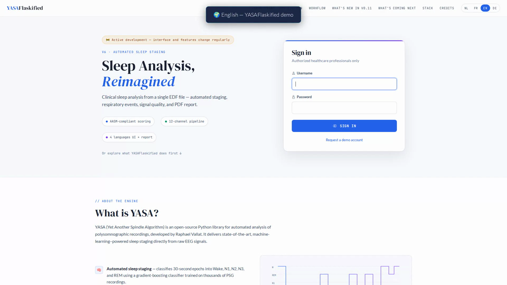

# YASAFlaskified

**Open-source web platform for automated polysomnography analysis.**

AI-based sleep staging + AASM-compliant respiratory scoring + multilingual clinical reports (NL/FR/EN/DE).

[](https://slaapkliniek.be)
[](https://pypi.org/project/psgscoring/)
[](LICENSE)
[](https://github.com/bartromb/YASAFlaskified/releases/latest)

## Demo

~90-second walkthrough of the full pipeline: landing → sign in → EDF upload → channel auto-selection → analysis start → dashboard → results → report editor.

[](https://github.com/bartromb/YASAFlaskified/releases/download/v0.11.2/en.mp4)

Available in 🇬🇧 [English](https://github.com/bartromb/YASAFlaskified/releases/download/v0.11.2/en.mp4) · 🇧🇪 [Dutch](https://github.com/bartromb/YASAFlaskified/releases/download/v0.11.2/nl.mp4) · 🇫🇷 [French](https://github.com/bartromb/YASAFlaskified/releases/download/v0.11.2/fr.mp4) · 🇩🇪 [German](https://github.com/bartromb/YASAFlaskified/releases/download/v0.11.2/de.mp4). Full-HD (1920×1080), ~7-8 MB each.

## Paper

> Rombaut B, Rombaut B, Rombaut C, et al. **An open-source, AASM-compliant tool for respiratory event detection in polysomnography.** Manuscript in preparation, 2026.

Technical supplement: **[psgscoring Technical Reference](https://github.com/bartromb/psgscoring/wiki/Technical-Reference)**

## What it does

Upload an anonymised EDF recording via browser → receive a complete PSG analysis within 5–10 minutes. No local Python, Docker, or GPU required.

**Try it:** [slaapkliniek.be](https://slaapkliniek.be) — request a free account via the corresponding author.

### Analysis pipeline

| Step | What | How |
|------|------|-----|
| 1 | Sleep staging | YASA LightGBM (Vallat & Walker, *eLife* 2021) |
| 2 | Respiratory scoring | psgscoring — AASM Manual rules with 12 bias corrections |
| 3 | Arousal detection | K-complex exclusion + CVR coupling |
| 4 | PLM scoring | AASM rules + WASM criteria |
| 5 | SpO₂ analysis | ODI 3%/4%, baseline (P90), T90 |
| 6 | Signal quality | Per-channel grading (flat-line, clipping, disconnect) |
| 7 | Clinical reports | PDF, Excel, EDF+, FHIR R4 — NL/FR/EN/DE |

### Key features

- **AHI confidence interval** — every study scored at three stringency levels with robustness grade (A/B/C)
- **12 bias corrections** — systematic over- and under-counting correction with per-fix event counters
- **Configurable scoring profiles** — strict / standard / sensitive
- **Interactive EDF browser** — event overlay with epoch navigation
- **Multi-site access control** — data isolation per clinical centre
- **Representative epoch examples** — signal snapshots in PDF report for clinical review

## Validation

- **PSG-IPA** (PhysioNet): 5 recordings, 59 scorer sessions — mean |ΔAHI| = 2.0/h, concordance 4/5
- **AZORG** (planned): n≥50, Bland-Altman, weighted κ — protocol AZORG-YASA-2026-001

## Self-hosting

```bash
git clone https://github.com/bartromb/YASAFlaskified.git
cd YASAFlaskified
cp .env.example .env   # configure SECRET_KEY, database path
docker compose up -d
```

Requirements: Docker, 4+ GB RAM. The platform runs on CPU only (Hetzner Ryzen 9 5950X, 128 GB RAM in production).

## Stack

Python 3.11 · Flask/Gunicorn · Redis 7 + RQ · MNE-Python · YASA 0.7 · psgscoring · ReportLab · Docker Compose

## Standalone library

The respiratory scoring algorithms are available as a standalone Python library:

```bash
pip install psgscoring
```

See [github.com/bartromb/psgscoring](https://github.com/bartromb/psgscoring) for documentation and the [Technical Reference](https://github.com/bartromb/psgscoring/wiki/Technical-Reference) for signal-processing details.

## Citation

```bibtex
@article{rombaut2026psgscoring,
  title     = {An open-source, {AASM}-compliant tool for respiratory event
               detection in polysomnography},
  author    = {Rombaut, Bart and Rombaut, Briek and Rombaut, Cedric},
  year      = {2026},
  note      = {Manuscript in preparation}
}
```

## Disclaimer

**YASAFlaskified and psgscoring are research software — not medical devices.** Not CE-marked (MDR 2017/745) or FDA-cleared. All reports include an explicit disclaimer and require physician verification before clinical action. See **[DISCLAIMER.md](DISCLAIMER.md)** for the full text.

## License

BSD-3-Clause. See [LICENSE](LICENSE).

---

*Contact: bart.rombaut@gmail.com*
