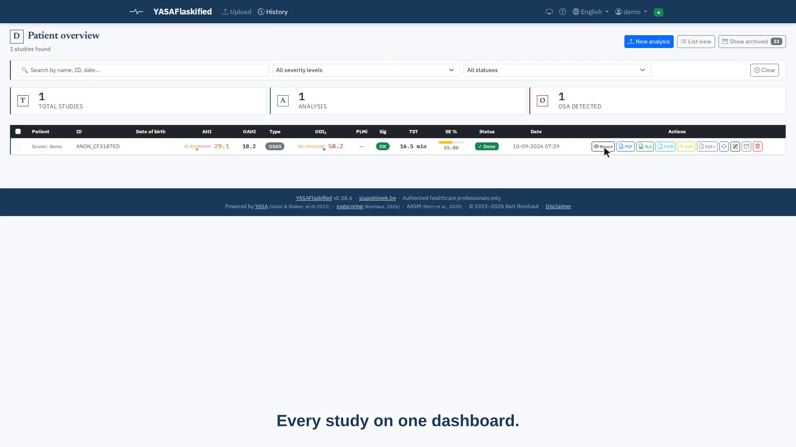

# YASAFlaskified

**Open-source web platform for automated polysomnography analysis.**

AI-based sleep staging + AASM-compliant respiratory scoring + multilingual clinical reports (NL/FR/EN/DE).

[](https://slaapkliniek.be)
[](https://pypi.org/project/psgscoring/)
[](LICENSE)
[](https://github.com/bartromb/YASAFlaskified/actions/workflows/ci.yml)
<!-- static release badge: the dynamic github/v/release endpoint intermittently
     fails with "Unable to select next GitHub token from pool" (shields.io token-pool
     rate limit). Bump the version here on each new release. -->
[](https://github.com/bartromb/YASAFlaskified/releases/latest)

## Demo

~90-second walkthrough of the full pipeline: landing → sign in → EDF upload → channel auto-selection → analysis start → dashboard → results → report editor.

[](https://github.com/bartromb/YASAFlaskified/releases/download/v0.11.2/en.mp4)

Available in 🇬🇧 [English](https://github.com/bartromb/YASAFlaskified/releases/download/v0.11.2/en.mp4) · 🇧🇪 [Dutch](https://github.com/bartromb/YASAFlaskified/releases/download/v0.11.2/nl.mp4) · 🇫🇷 [French](https://github.com/bartromb/YASAFlaskified/releases/download/v0.11.2/fr.mp4) · 🇩🇪 [German](https://github.com/bartromb/YASAFlaskified/releases/download/v0.11.2/de.mp4). Full-HD (1920×1080), ~7-8 MB each.

## Paper

> Rombaut B, Rombaut B, Rombaut C, et al. **Graded evidence in place of thresholds: an open-source, AASM-compliant method for respiratory event detection in polysomnography.** Manuscript in preparation, 2026.

Technical supplement: **[psgscoring Technical Reference](https://github.com/bartromb/psgscoring/wiki/Technical-Reference)**

## What it does

Upload an anonymised EDF recording via browser → receive a complete PSG analysis within 5–10 minutes. No local Python, Docker, or GPU required.

**Try it:** [slaapkliniek.be](https://slaapkliniek.be) — request a free account via the corresponding author.

### Analysis pipeline

| Step | What | How |
|------|------|-----|
| 1 | Sleep staging | YASA LightGBM (Vallat & Walker, *eLife* 2021) |
| 2 | Respiratory scoring | psgscoring — AASM Manual rules, graded evidence, measured bias corrections |
| 3 | Arousal detection | K-complex exclusion + CVR coupling |
| 4 | PLM scoring | AASM rules + WASM criteria |
| 5 | SpO₂ analysis | ODI 3%/4%, baseline (P90), T90 |
| 6 | Signal quality | Per-channel grading (flat-line, clipping, disconnect) |
| 7 | Clinical reports | PDF, Excel, EDF+, FHIR R4 — NL/FR/EN/DE |

### Key features

- **AHI confidence interval** — every study scored at three stringency levels, reported as a range
- **Graded evidence** — the AASM Rule 1A conjunction as a product of graded
  terms rather than a chain of yes/no cuts; on MESA (n=150, held out) that
  raises event agreement over the rule cascade without costing AHI accuracy
- **Bias corrections with the measurement attached** — systematic over- and
  under-counting correction with per-fix event counters; every change carries
  the measurement that motivated it in the psgscoring `CHANGELOG`
- **Visual event review** — an administrator route (`/review/<job_id>`) that
  draws every scored respiratory event with its signals, its qualifying rule,
  and the neighbouring events that were *not* scored
- **Configurable scoring profiles** — strict / standard / sensitive
- **Interactive EDF browser** — event overlay with epoch navigation
- **Multi-site access control** — data isolation per clinical centre, enforced from a `job` table in the database on every job route ([details](MULTI_SITE_GUIDE.md#toegangsmodel-klinische-sites-binnen-één-stack))
- **Representative epoch examples** — signal snapshots in PDF report for clinical review

## Validation

- **PSG-IPA** (PhysioNet): 5 recordings, 59 scorer sessions — bias +1.69/h, MAE 1.76/h, r = 0.997, weighted κ = 0.839, severity concordance 4/5
- **MESA** (NSRR, n=150, held out): bias −5.30/h, MAE 10.12/h on the default profile; breath-graded scoring raises event F1 by +0.029 (p = 7·10⁻⁸). Full table in the [psgscoring README](https://github.com/bartromb/psgscoring#validation)
- **AZORG** (approved, EC 2026-07-23): n≥50, Bland-Altman, weighted κ — protocol AZORG-YASA-2026-001

Five recordings and one external cohort is enough to expose defects, not
enough to represent another centre's population. If you are considering this
software, see **[Using it in your own centre](#using-it-in-your-own-centre)**.

## Release policy

Releases are **measurement points, not milestones**. Several may be cut on the
same day: each one pins a validated combination of this app and a `psgscoring`
version, and the version number is what makes that combination citable.

Scored output is produced by `psgscoring`, so the stability guarantee lives
there — in the **profiles**, not in this app's version number. `mesa_shhs` and
`chicago_1999` are frozen because they reproduce published results; the other
profiles track the current best understanding of the AASM rules and may move
when a measurement justifies it.

If you need scored values to stay identical across time, pin both: the
`psgscoring` version in `requirements.txt` (also recorded in
`myproject/version.py` as `PSGSCORING_VERSION`) and the profile you selected.
A profile name alone is not a guarantee.

## Self-hosting

**One command, fresh server.** On a vanilla Ubuntu 22.04+ / Debian host,
[`deploy.sh`](deploy.sh) installs the whole stack — Docker, Nginx, UFW, a
generated `SECRET_KEY`, the job-registry backfill, and optionally a Let's
Encrypt certificate:

```bash
curl -sSL https://raw.githubusercontent.com/bartromb/YASAFlaskified/main/deploy.sh | sudo bash
```

It is version-agnostic: it installs whatever `myproject/version.py` declares,
so it does not need bumping per release. To purge an existing install and
reinstall from scratch, use [`redeploy.sh`](redeploy.sh) — it generates a
**new** admin password.

**Existing Docker host.** If you already run Docker and want to manage Nginx
and TLS yourself:

```bash
git clone https://github.com/bartromb/YASAFlaskified.git
cd YASAFlaskified
cp .env.example .env   # configure SECRET_KEY, database path
docker compose up -d
```

Requirements: Docker, 4+ GB RAM. The platform runs on CPU only (Hetzner Ryzen 9 5950X, 128 GB RAM in production).

Upgrades, backups, rollback and the multi-site setup are in
**[DEPLOY_RUNBOOK.md](DEPLOY_RUNBOOK.md)**.

## Using it in your own centre

Other sleep centres are explicitly invited to install this, modify it, and
test it against their own scoring — BSD-3, no licence fee, no permission
needed. What we ask in return is not payment but contradiction: numbers from
your own cohort, especially where they disagree with ours.

Three routes: a free account on [slaapkliniek.be](https://slaapkliniek.be) for
pseudonymised recordings, self-hosting via `deploy.sh` above, or
`pip install psgscoring` to run the scoring logic inside your own pipeline.

**Before you rely on it, read these.** They are here rather than in the small
print because we have an interest in you adopting the software:

1. **Not a medical device.** Not CE-marked (MDR 2017/745), not FDA-cleared.
   Research software. Every report requires physician review before any
   diagnostic or therapeutic decision.
2. **Validated on five recordings and one external cohort.** See
   [Validation](#validation). Montages, sensors and scoring habits differ per
   centre, and the two cohorts contradict each other on some points.
3. **Test it against your own scoring first.** Score a few dozen recordings
   your team has already read, and look at Bland-Altman and weighted κ — not a
   mean AHI. An average hides exactly the spread that matters.
4. **The AHI is an estimate with an interval.** Each study gets a robustness
   grade A/B/C. A C means the AHI depends heavily on where the threshold is
   drawn — information about the recording, not a defect.
5. **Personal data stays your responsibility.** The hosted instance runs in the
   EU (Hetzner, Germany), but upload only pseudonymised EDFs; use
   [`anonymize_edf.py`](anonymize_edf.py). For identifiable data, self-host —
   your centre then remains the data controller.
6. **No support SLA.** This is one clinical team, not a company. Issues are
   read and usually answered, with no guaranteed response time. To keep scored
   values identical over time, pin both the `psgscoring` version and the
   profile; only `mesa_shhs` and `chicago_1999` are frozen.

Considering it, or already tested it and your numbers differ? The latter is
what we most want to hear — *bart.rombaut@gmail.com*.

## Stack

Python 3.11 · Flask/Gunicorn · Redis 7 + RQ · MNE-Python · YASA 0.7 · psgscoring · ReportLab · Docker Compose

## Standalone library

The respiratory scoring algorithms are available as a standalone Python library:

```bash
pip install psgscoring
```

See [github.com/bartromb/psgscoring](https://github.com/bartromb/psgscoring) for documentation and the [Technical Reference](https://github.com/bartromb/psgscoring/wiki/Technical-Reference) for signal-processing details.

## Citation

```bibtex
@article{rombaut2026psgscoring,
  title     = {Graded evidence in place of thresholds: an open-source,
               {AASM}-compliant method for respiratory event detection in
               polysomnography},
  author    = {Rombaut, Bart and Rombaut, Briek and Rombaut, Cedric},
  year      = {2026},
  note      = {Manuscript in preparation}
}
```

## Disclaimer

**YASAFlaskified and psgscoring are research software — not medical devices.** Not CE-marked (MDR 2017/745) or FDA-cleared. All reports include an explicit disclaimer and require physician verification before clinical action. See **[DISCLAIMER.md](https://github.com/bartromb/YASAFlaskified/blob/main/DISCLAIMER.md)** for the full text.

## License

BSD-3-Clause. See [LICENSE](LICENSE).

---

*Contact: bart.rombaut@gmail.com*
